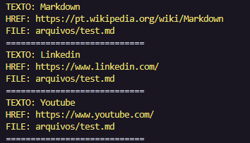
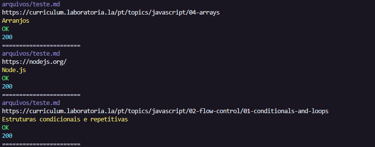
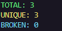
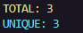

# MDLinks

## Índice

* [1. Prefácio](#1-prefácio)
* [2. Resumo do projeto](#2-resumo-do-projeto)
* [3. Instruções Instalação e uso](#3-instruções-instalação-e-uso)
* [4. Fluxograma](#4-fluxograma)
* [5. Tecnologias utilizadas](#5-tecnologias-utilizadas)

***

## 1. Prefácio

[Markdown](https://pt.wikipedia.org/wiki/Markdown) é uma linguagem de marcação
muito popular entre os programadores. É usada em muitas plataformas que
manipulam texto (GitHub, fórum, blogs e etc) e é muito comum encontrar arquivos
com este formato em qualquer repositório (começando pelo tradicional
`README.md`).

Os arquivos `Markdown` normalmente contém _links_ que podem estar
quebrados, ou que já não são válidos, prejudicando muito o valor da
informação que está ali.

Uma comunidade open source nos propôs criar uma ferramenta, usando
[Node.js](https://nodejs.org/), que leia e analise arquivos no formato
`Markdown`, para verificar os arquivos que contenham links e mostrar algumas
estatísticas.

## 2. Resumo do projeto

Neste projeto, foi criada uma ferramenta de linha de comando (CLI), utilizando o Node.js, assim como a sua própria biblioteca (library) em Javascript.

Essa ferramenta analisa um arquivo markdown e retorna no terminal a lista de links presentes nele, assim como a rota do arquivo, a URL e o texto do link. É possível também validar e ver as estatísticas de cada link.

## 3. Instruções Instalação e uso

Para instalar a biblioteca, execute o seguinte comando no seu terminal:

Após a instalação é possível executar o seguinte comando:

`md-links./nomeDoDiretório/nomeDoArquivo.md`

Esse comando retorna a lista de todos os links presentes em um arquivo .md.

Ao adicionar --validate após o nome do arquivo, irá mostrar quais links estão OK na cor verde ou com falha (quebrados) na cor vermelha.

Colocando a opção --stats e --validate, irá mostrar o total de links, links únicos e será retornado quantos desses links estão quebrados.

Caso a opção adicionada for --stats, irá mostrar o total de links e links únicos

## 4. Tecnologias utilizadas

   
  
  
  
  

